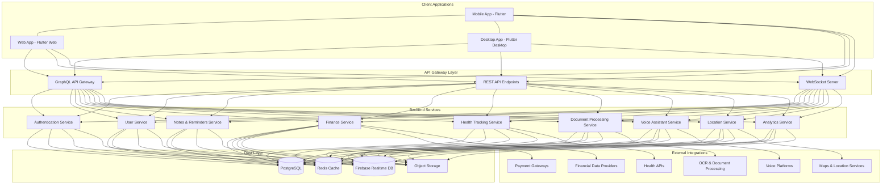

# Personal Assistant App: Technical Architecture

This document outlines the comprehensive technical architecture for our cross-platform personal assistant application. The architecture is designed to support all required features while ensuring performance, scalability, security, and an exceptional user experience across platforms.

## Table of Contents

1. [Tech Stack Selection](#tech-stack-selection)
2. [System Architecture Diagram](#system-architecture-diagram)
3. [Database Schema](#database-schema)
4. [API Design](#api-design)
5. [Third-Party Integrations](#third-party-integrations)
6. [Implementation Approach for Key Features](#implementation-approach-for-key-features)
7. [Security & Privacy Architecture](#security--privacy-architecture)
8. [Performance Considerations](#performance-considerations)
9. [Deployment Strategy](#deployment-strategy)

## Tech Stack Selection

### Frontend

**Primary Framework: Flutter**

Based on our research comparing cross-platform frameworks, we've selected **Flutter** for the following reasons:

1. **Unified Codebase**: Flutter provides a single codebase for Android, iOS, web, and desktop platforms, reducing development time and maintenance costs.
2. **Superior UI Customization**: Flutter's widget-based architecture allows for pixel-perfect UI implementation across platforms, essential for our design-focused app.
3. **Performance**: Flutter's direct rendering through the Skia engine and AOT compilation delivers near-native performance (60-120 fps), crucial for smooth animations and transitions.
4. **Rich Widget Library**: Flutter's extensive widget toolkit supports both Material Design and Cupertino, allowing us to implement the clean, card-based layouts seen in our design inspiration.
5. **Growing Ecosystem**: Flutter has a rapidly growing ecosystem with strong Google backing and increasing enterprise adoption.

**Supporting Frontend Technologies:**

| Technology | Purpose | Justification |
|------------|---------|---------------|
| **Provider/Riverpod** | State Management | Reactive state management with efficient rebuilds and dependency injection |
| **Hive** | Local Storage | Fast, lightweight NoSQL database for client-side storage with encryption support |
| **dio** | HTTP Client | Feature-rich HTTP client with interceptors, FormData, request cancellation |
| **flutter_localizations** | Internationalization | Built-in support for multiple languages |
| **fl_chart** | Data Visualization | Customizable, responsive charts for financial and health data visualization |
| **camera** | Camera Access | Camera integration for document scanning |
| **google_ml_kit** | On-device ML | Text recognition, face detection, and language processing |
| **flutter_local_notifications** | Notifications | Cross-platform notification management |
| **geolocator** | Location Services | Location tracking for location-based reminders |
| **flutter_tts** | Text-to-Speech | Voice feedback for the voice assistant feature |
| **speech_to_text** | Speech Recognition | Voice command processing |

### Backend

**Primary Backend: Firebase + Custom NestJS API**

We'll implement a hybrid backend approach:

1. **Firebase** for authentication, real-time features, and cloud functions
2. **NestJS** (Node.js) for custom business logic, third-party integrations, and complex data processing

**Supporting Backend Technologies:**

| Technology | Purpose | Justification |
|------------|---------|---------------|
| **TypeScript** | Programming Language | Type safety, better tooling, and improved maintainability |
| **PostgreSQL** | Primary Database | Robust relational database for structured data with JSON support |
| **Redis** | Caching & Pub/Sub | Fast in-memory data store for caching and real-time messaging |
| **GraphQL** | API Query Language | Efficient data fetching with precise client requests |
| **Apollo Server** | GraphQL Server | Production-ready GraphQL server with excellent TypeScript integration |
| **Prisma** | ORM | Type-safe database access with migrations and schema management |
| **Jest** | Testing | Comprehensive testing framework for backend services |
| **Docker** | Containerization | Consistent development and deployment environments |
| **Kubernetes** | Orchestration | Scalable, resilient deployment for production |
| **Terraform** | Infrastructure as Code | Reproducible infrastructure setup across environments |

### DevOps & Infrastructure

| Technology | Purpose | Justification |
|------------|---------|---------------|
| **GitHub Actions** | CI/CD | Automated testing, building, and deployment |
| **AWS/GCP** | Cloud Provider | Comprehensive cloud services with global reach |
| **CloudFront/Cloud CDN** | Content Delivery | Fast delivery of static assets globally |
| **S3/Cloud Storage** | Object Storage | Secure storage for user-generated content |
| **CloudWatch/Cloud Monitoring** | Monitoring | Real-time monitoring and alerting |
| **AWS Lambda/Cloud Functions** | Serverless Computing | Event-driven background processing |

## System Architecture Diagram



### Architecture Components

1. **Client Applications**: Flutter-based applications for mobile, web, and desktop platforms sharing a common codebase with platform-specific adaptations.

2. **API Gateway Layer**:
   - GraphQL API for efficient data fetching
   - REST endpoints for specific operations
   - WebSocket server for real-time updates

3. **Backend Services**:
   - Microservices architecture with domain-specific services
   - Each service responsible for a specific feature domain
   - Services communicate via message broker and direct API calls

4. **Data Layer**:
   - PostgreSQL for structured data storage
   - Redis for caching and pub/sub messaging
   - Firebase Realtime Database for real-time features
   - Object Storage for user-generated content (documents, images)

5. **External Integrations**:
   - Integration with third-party services via APIs
   - Abstraction layer to handle API changes and service substitutions

## Database Schema

The database schema is designed to support all required features while maintaining data integrity and performance. We'll use PostgreSQL as our primary database with the following schema:

```mermaid
erDiagram
    USERS {
        uuid id PK
        string email
        string hashed_password
        string first_name
        string last_name
        timestamp created_at
        timestamp updated_at
        json preferences
        string timezone
        string language
    }
    
    NOTES {
        uuid id PK
        uuid user_id FK
        string title
        text content
        json rich_content
        timestamp created_at
        timestamp updated_at
        string[] tags
        boolean is_archived
        boolean is_pinned
        uuid folder_id FK
    }
    
    FOLDERS {
        uuid id PK
        uuid user_id FK
        string name
        string color
        timestamp created_at
        timestamp updated_at
        uuid parent_id FK
    }
    
    REMINDERS {
        uuid id PK
        uuid user_id FK
        string title
        text description
        timestamp due_date
        timestamp created_at
        timestamp updated_at
        boolean is_completed
        string recurrence_rule
        uuid related_entity_id
        string related_entity_type
        json location
    }
    
    TRANSACTIONS {
        uuid id PK
        uuid user_id FK
        decimal amount
        string currency
        timestamp date
        string description
        uuid category_id FK
        string payment_method
        boolean is_income
        uuid account_id FK
        string merchant
        json receipt_data
        string source
    }
    
    CATEGORIES {
        uuid id PK
        uuid user_id FK
        string name
        string color
        string icon
        string type
        uuid parent_id FK
    }
    
    ACCOUNTS {
        uuid id PK
        uuid user_id FK
        string name
        string type
        string institution
        decimal balance
        string currency
        timestamp last_updated
        json metadata
    }
    
    BUDGETS {
        uuid id PK
        uuid user_id FK
        string name
        decimal amount
        string period
        timestamp start_date
        timestamp end_date
        uuid[] category_ids
        boolean is_recurring
    }
    
    BILLS {
        uuid id PK
        uuid user_id FK
        string name
        decimal amount
        string currency
        timestamp due_date
        string recurrence_rule
        boolean is_paid
        uuid account_id FK
        string payee
        json metadata
    }
    
    INVESTMENTS {
        uuid id PK
        uuid user_id FK
        string symbol
        string name
        string type
        decimal quantity
        decimal purchase_price
        timestamp purchase_date
        uuid account_id FK
        json metadata
    }
    
    TASKS {
        uuid id PK
        uuid user_id FK
        string title
        text description
        timestamp due_date
        int priority
        boolean is_completed
        timestamp completed_at
        uuid[] subtask_ids
        uuid list_id FK
        json metadata
    }
    
    TASK_LISTS {
        uuid id PK
        uuid user_id FK
        string name
        string color
        string icon
        timestamp created_at
        timestamp updated_at
    }
    
    HEALTH_METRICS {
        uuid id PK
        uuid user_id FK
        string metric_type
        decimal value
        string unit
        timestamp recorded_at
        json source_data
    }
    
    HEALTH_GOALS {
        uuid id PK
        uuid user_id FK
        string metric_type
        decimal target_value
        string unit
        timestamp start_date
        timestamp end_date
        string recurrence_rule
    }
    
    HABITS {
        uuid id PK
        uuid user_id FK
        string name
        string description
        string frequency
        time preferred_time
        string[] days_of_week
        timestamp created_at
        timestamp updated_at
        string color
        string icon
    }
    
    HABIT_LOGS {
        uuid id PK
        uuid habit_id FK
        timestamp completed_at
        decimal value
        json metadata
    }
    
    DOCUMENTS {
        uuid id PK
        uuid user_id FK
        string name
        string file_path
        string file_type
        timestamp created_at
        timestamp updated_at
        string[] tags
        json metadata
        uuid folder_id FK
    }
    
    WIDGETS {
        uuid id PK
        uuid user_id FK
        string widget_type
        json configuration
        int position_x
        int position_y
        int width
        int height
        timestamp created_at
        timestamp updated_at
    }
    
    TRAVEL_PLANS {
        uuid id PK
        uuid user_id FK
        string destination
        timestamp start_date
        timestamp end_date
        json itinerary
        json accommodation
        json transportation
        string[] tags
    }
    
    USER_PREFERENCES {
        uuid id PK
        uuid user_id FK
        json theme_settings
        json notification_settings
        json privacy_settings
        json feature_toggles
        timestamp updated_at
    }
    
    USERS ||--o{ NOTES : creates
    USERS ||--o{ FOLDERS : creates
    USERS ||--o{ REMINDERS : creates
    USERS ||--o{ TRANSACTIONS : records
    USERS ||--o{ CATEGORIES : creates
    USERS ||--o{ ACCOUNTS : owns
    USERS ||--o{ BUDGETS : creates
    USERS ||--o{ BILLS : manages
    USERS ||--o{ INVESTMENTS : tracks
    USERS ||--o{ TASKS : creates
    USERS ||--o{ TASK_LISTS : creates
    USERS ||--o{ HEALTH_METRICS : records
    USERS ||--o{ HEALTH_GOALS : sets
    USERS ||--o{ HABITS : tracks
    USERS ||--o{ DOCUMENTS : uploads
    USERS ||--o{ WIDGETS : configures
    USERS ||--o{ TRAVEL_PLANS : creates
    USERS ||--|| USER_PREFERENCES : has
    
    FOLDERS ||--o{ NOTES : contains
    FOLDERS ||--o{ FOLDERS : contains
    
    CATEGORIES ||--o{ TRANSACTIONS : categorizes
    CATEGORIES ||--o{ CATEGORIES : contains
    
    ACCOUNTS ||--o{ TRANSACTIONS : records
    ACCOUNTS ||--o{ BILLS : pays
    ACCOUNTS ||--o{ INVESTMENTS : holds
    
    TASK_LISTS ||--o{ TASKS : contains
    
    HABITS ||--o{ HABIT_LOGS : records
```



### Data Models

The schema above represents the core data models. Additional considerations:

1. **JSON Fields**: Used for flexible, schema-less data storage where appropriate (preferences, metadata, etc.)
2. **Relationships**: Properly defined with foreign keys to maintain data integrity
3. **Timestamps**: Created and updated timestamps for auditing and synchronization
4. **Soft Deletion**: Implemented for relevant entities to preserve data history

## API Design

We'll implement a GraphQL API as the primary interface with REST endpoints for specific operations. This approach provides:

1. **Efficient Data Fetching**: Clients request exactly what they need
2. **Reduced Network Traffic**: Minimizes over-fetching and under-fetching
3. **Strong Typing**: Schema-based API with type safety
4. **Real-time Capabilities**: Subscriptions for live updates

### GraphQL Schema (Core Examples)

```graphql
type User {
  id: ID!
  email: String!
  firstName: String!
  lastName: String!
  createdAt: DateTime!
  updatedAt: DateTime!
  preferences: JSONObject
  timezone: String
  language: String
  notes: [Note!]
  folders: [Folder!]
  reminders: [Reminder!]
  transactions: [Transaction!]
  categories: [Category!]
  accounts: [Account!]
  budgets: [Budget!]
  bills: [Bill!]
  investments: [Investment!]
  tasks: [Task!]
  taskLists: [TaskList!]
  healthMetrics: [HealthMetric!]
  healthGoals: [HealthGoal!]
  habits: [Habit!]
  documents: [Document!]
  widgets: [Widget!]
  travelPlans: [TravelPlan!]
}

type Note {
  id: ID!
  user: User!
  title: String!
  content: String
  richContent: JSONObject
  createdAt: DateTime!
  updatedAt: DateTime!
  tags: [String!]
  isArchived: Boolean!
  isPinned: Boolean!
  folder: Folder
}

type Reminder {
  id: ID!
  user: User!
  title: String!
  description: String
  dueDate: DateTime!
  createdAt: DateTime!
  updatedAt: DateTime!
  isCompleted: Boolean!
  recurrenceRule: String
  relatedEntityId: ID
  relatedEntityType: String
  location: Location
}

type Transaction {
  id: ID!
  user: User!
  amount: Decimal!
  currency: String!
  date: DateTime!
  description: String!
  category: Category
  paymentMethod: String
  isIncome: Boolean!
  account: Account!
  merchant: String
  receiptData: JSONObject
  source: String
}

# Query examples
type Query {
  me: User
  note(id: ID!): Note
  notes(
    filter: NoteFilter
    pagination: PaginationInput
    sort: [SortInput!]
  ): NoteConnection!
  
  reminder(id: ID!): Reminder
  reminders(
    filter: ReminderFilter
    pagination: PaginationInput
    sort: [SortInput!]
  ): ReminderConnection!
  
  transaction(id: ID!): Transaction
  transactions(
    filter: TransactionFilter
    pagination: PaginationInput
    sort: [SortInput!]
  ): TransactionConnection!
  
  # Additional queries for other entities...
}

# Mutation examples
type Mutation {
  createNote(input: CreateNoteInput!): Note!
  updateNote(id: ID!, input: UpdateNoteInput!): Note!
  deleteNote(id: ID!): Boolean!
  
  createReminder(input: CreateReminderInput!): Reminder!
  updateReminder(id: ID!, input: UpdateReminderInput!): Reminder!
  deleteReminder(id: ID!): Boolean!
  completeReminder(id: ID!): Reminder!
  
  createTransaction(input: CreateTransactionInput!): Transaction!
  updateTransaction(id: ID!, input: UpdateTransactionInput!): Transaction!
  deleteTransaction(id: ID!): Boolean!
  
  # Additional mutations for other entities...
}

# Subscription examples
type Subscription {
  reminderDue: Reminder!
  newTransaction: Transaction!
  healthMetricUpdated: HealthMetric!
  
  # Additional subscriptions for real-time updates...
}
```

### REST API Endpoints

While GraphQL will be our primary API, we'll implement REST endpoints for specific use cases:

1. **Authentication**: `/api/auth/login`, `/api/auth/register`, `/api/auth/refresh-token`
2. **File Upload**: `/api/documents/upload`
3. **Webhooks**: `/api/webhooks/sms`, `/api/webhooks/payment-confirmation`
4. **Export/Import**: `/api/export/data`, `/api/import/data`

### API Security

1. **Authentication**: JWT-based authentication with refresh tokens
2. **Authorization**: Role-based access control with fine-grained permissions
3. **Rate Limiting**: Prevent abuse with appropriate rate limits
4. **Input Validation**: Strict validation of all inputs
5. **CORS**: Properly configured Cross-Origin Resource Sharing

## Third-Party Integrations

The app will integrate with various third-party services to provide comprehensive functionality. Here's a matrix of the key integrations:

| Category | Service | Purpose | Integration Method | Data Flow |
|----------|---------|---------|-------------------|-----------|
| **Authentication** | Firebase Auth | User authentication | SDK | Bidirectional |
| | Google Sign-In | Social login | OAuth 2.0 | Inbound |
| | Apple Sign-In | Social login | OAuth 2.0 | Inbound |
| **Voice Assistants** | Google Assistant | Voice commands | Actions on Google | Bidirectional |
| | Amazon Alexa | Voice commands | Alexa Skills Kit | Bidirectional |
| | Siri | Voice commands | SiriKit | Bidirectional |
| **Financial Data** | Plaid | Bank account integration | REST API | Bidirectional |
| | Finicity | Alternative bank integration | REST API | Bidirectional |
| | Yodlee | Financial account aggregation | REST API | Inbound |
| | Alpha Vantage | Investment data | REST API | Inbound |
| **Health Data** | Google Fit | Health metrics | REST API + SDK | Bidirectional |
| | Apple HealthKit | Health metrics | SDK | Bidirectional |
| | Fitbit | Fitness tracking | OAuth + REST API | Bidirectional |
| **Location Services** | Google Maps | Location data, geocoding | SDK + REST API | Bidirectional |
| | Mapbox | Alternative mapping | SDK + REST API | Bidirectional |
| **Document Processing** | Google Cloud Vision | OCR for documents | REST API | Outbound |
| | Tesseract.js | On-device OCR | Library | Local |
| **SMS Processing** | Twilio | SMS reception and parsing | Webhooks + REST API | Bidirectional |
| | Vonage | Alternative SMS service | Webhooks + REST API | Bidirectional |
| **Notifications** | Firebase Cloud Messaging | Push notifications | SDK | Outbound |
| | OneSignal | Cross-platform notifications | SDK + REST API | Outbound |
| **Calendar Integration** | Google Calendar | Calendar sync | REST API | Bidirectional |
| | Apple Calendar | Calendar sync | SDK | Bidirectional |
| | Microsoft Outlook | Calendar sync | Microsoft Graph API | Bidirectional |
| **Email Integration** | SendGrid | Transactional emails | REST API | Outbound |
| | Mailgun | Alternative email service | REST API | Outbound |
| **Weather Data** | OpenWeatherMap | Weather forecasts | REST API | Inbound |
| | Weather API | Alternative weather data | REST API | Inbound |
| **Travel Information** | Amadeus | Flight and hotel data | REST API | Inbound |
| | Skyscanner | Travel pricing | REST API | Inbound |
| **AI Services** | OpenAI | Natural language processing | REST API | Bidirectional |
| | Google Cloud NLP | Text analysis | REST API | Outbound |
| | TensorFlow Lite | On-device ML | Library | Local |

### Integration Architecture

For each third-party integration, we'll implement:

1. **Abstraction Layer**: Service interfaces that abstract the underlying implementation
2. **Adapter Pattern**: Adapters for each service that implement the interfaces
3. **Fallback Mechanisms**: Alternative services or graceful degradation when services are unavailable
4. **Caching Strategy**: Appropriate caching to reduce API calls and improve performance
5. **Credential Management**: Secure storage and rotation of API keys and tokens

## Implementation Approach for Key Features

### Notes & Reminders

**Architecture Components:**
- Local SQLite database with cloud sync
- Rich text editor component
- Background service for reminders
- Full-text search engine

**Implementation Strategy:**
1. Implement a WYSIWYG editor using `flutter_quill` or similar library
2. Store notes in local database with periodic sync to cloud
3. Use platform-specific notification APIs for reminders
4. Implement a tagging system with full-text search
5. Support offline mode with conflict resolution on sync

**Technical Considerations:**
- Efficient sync algorithm to handle conflicts
- Compression for rich content to reduce storage requirements
- Optimized search indexing for quick retrieval

### Expense Tracking from SMS

**Architecture Components:**
- SMS listener service
- Template-based parsing engine
- NLP for unstructured text
- Categorization system

**Implementation Strategy:**
1. Register SMS listener using platform-specific APIs
2. Implement template matching for known SMS formats
3. Use NLP for extracting information from unstructured messages
4. Automatically categorize transactions based on merchant and description
5. Provide manual override for incorrect parsing

**Technical Considerations:**
- Privacy-focused design with on-device processing
- Adaptive learning from user corrections
- Battery-efficient background processing

### Budgeting & Finance Management

**Architecture Components:**
- Double-entry accounting system
- Data visualization engine
- Financial goal tracking
- Bill payment reminder system

**Implementation Strategy:**
1. Implement a double-entry accounting system for accurate financial tracking
2. Use `fl_chart` for interactive financial visualizations
3. Create a goal tracking system with progress indicators
4. Develop a bill payment reminder system with due date tracking
5. Integrate with financial data providers for investment tracking

**Technical Considerations:**
- Secure storage for financial information
- Efficient data aggregation for reports
- Real-time updates for investment data

### Voice Assistant Integration

**Architecture Components:**
- Voice capture module
- On-device processing
- Intent recognition system
- Command execution engine

**Implementation Strategy:**
1. Implement voice capture using platform-specific APIs
2. Use TensorFlow Lite for on-device intent recognition
3. Create a command registry for mapping intents to actions
4. Develop a natural language response generator
5. Integrate with platform voice assistants (Siri, Google Assistant)

**Technical Considerations:**
- Privacy-preserving design with on-device processing when possible
- Fallback to cloud processing for complex commands
- Continuous learning from user interactions

### Health & Wellness Tracking

**Architecture Components:**
- Platform health API integration
- Habit tracking system
- Goal setting and monitoring
- Data visualization

**Implementation Strategy:**
1. Integrate with HealthKit (iOS) and Health Connect (Android)
2. Implement a habit tracking system with streak counting
3. Create a goal setting interface with progress tracking
4. Develop visualizations for health metrics and trends
5. Implement insights generation based on collected data

**Technical Considerations:**
- Privacy-focused design for sensitive health data
- Efficient storage and retrieval of time-series data
- Battery-efficient background processing

### Smart To-Do Lists

**Architecture Components:**
- Task graph data structure
- Natural language processing
- Priority algorithm
- Context-aware suggestions

**Implementation Strategy:**
1. Implement a task graph for managing dependencies
2. Use NLP for quick task creation from text
3. Develop an algorithm for intelligent task prioritization
4. Create a notification system for timely reminders
5. Implement context-aware task suggestions

**Technical Considerations:**
- Efficient graph traversal for complex task relationships
- Learning algorithm for improving suggestions over time
- Synchronization across devices

### Document & Receipt Scanning

**Architecture Components:**
- Camera integration
- Image processing pipeline
- OCR engine
- Document storage system

**Implementation Strategy:**
1. Implement camera capture with edge detection
2. Create an image processing pipeline for enhancement
3. Use ML Kit or TensorFlow Lite for on-device OCR
4. Develop parsers for common document formats
5. Implement a secure document storage system

**Technical Considerations:**
- Efficient image processing on mobile devices
- Accuracy optimization for OCR
- Secure storage for sensitive documents

### Location-Based Reminders

**Architecture Components:**
- Geofencing service
- Location monitoring
- Reminder trigger system
- Map integration

**Implementation Strategy:**
1. Implement geofencing using platform location APIs
2. Create a battery-efficient location monitoring service
3. Develop a system for triggering reminders based on location
4. Integrate with mapping services for location selection
5. Implement proximity-based sorting for nearby reminders

**Technical Considerations:**
- Battery-efficient location monitoring
- Privacy-preserving location tracking
- Accurate geofence triggering

### Customizable Widgets

**Architecture Components:**
- Widget framework
- Data source connectors
- Layout engine
- Theme system

**Implementation Strategy:**
1. Create a flexible widget framework with standard interfaces
2. Implement data source connectors for various app features
3. Develop a layout engine for widget positioning
4. Create a theme system for consistent styling
5. Implement widget state persistence

**Technical Considerations:**
- Efficient rendering of multiple widgets
- Data synchronization between widgets and main app
- Layout optimization for different screen sizes

### AI-Powered Suggestions

**Architecture Components:**
- User behavior tracking
- Pattern recognition engine
- Suggestion generation system
- Feedback mechanism

**Implementation Strategy:**
1. Implement privacy-focused behavior tracking
2. Use on-device ML for pattern recognition
3. Develop algorithms for generating contextual suggestions
4. Create a feedback system for improving suggestions
5. Implement a notification system for timely suggestions

**Technical Considerations:**
- Privacy-preserving design for behavior tracking
- Efficient on-device ML processing
- Continuous learning from user feedback

## Security & Privacy Architecture

Security and privacy are fundamental to our app design, especially given the sensitive nature of the data being processed.

### Data Protection

1. **Encryption**:
   - End-to-end encryption for sensitive data
   - AES-256 encryption for data at rest
   - TLS 1.3 for data in transit

2. **Authentication**:
   - Multi-factor authentication
   - Biometric authentication (fingerprint, face ID)
   - Secure token management

3. **Authorization**:
   - Fine-grained permission model
   - Principle of least privilege
   - Regular permission audits

### Privacy Measures

1. **Data Minimization**:
   - Collect only necessary data
   - Implement configurable data retention policies
   - Provide data export and deletion options

2. **Local Processing**:
   - Process sensitive data on-device when possible
   - Minimize cloud dependencies for privacy-sensitive features
   - Transparent data flow indicators

3. **User Control**:
   - Granular privacy settings
   - Clear consent mechanisms
   - Comprehensive privacy dashboard

### Compliance Framework

1. **Regulatory Compliance**:
   - GDPR compliance for European users
   - CCPA compliance for California residents
   - HIPAA considerations for health data

2. **Security Standards**:
   - OWASP Mobile Top 10 mitigations
   - NIST Cybersecurity Framework alignment
   - Regular security assessments

## Performance Considerations

Performance is critical for user satisfaction and retention. Our architecture addresses performance through:

### Client-Side Optimization

1. **Efficient Rendering**:
   - Widget recycling and virtualization
   - Lazy loading of content
   - Optimized image loading and caching

2. **State Management**:
   - Granular rebuilds with Provider/Riverpod
   - Memoization of expensive computations
   - Background processing for intensive tasks

3. **Data Management**:
   - Efficient local database queries
   - Pagination for large datasets
   - Incremental loading of content

### Backend Optimization

1. **Scalable Architecture**:
   - Horizontal scaling of services
   - Database sharding for high-volume data
   - Caching at multiple levels

2. **Efficient Data Transfer**:
   - GraphQL for precise data fetching
   - Data compression
   - Binary protocols where appropriate

3. **Background Processing**:
   - Asynchronous processing of intensive tasks
   - Queue-based architecture for peak handling
   - Scheduled jobs for predictable workloads

## Deployment Strategy

Our deployment strategy ensures reliable, consistent releases across platforms:

### CI/CD Pipeline

1. **Continuous Integration**:
   - Automated testing on commit
   - Code quality checks
   - Security scanning

2. **Continuous Deployment**:
   - Automated builds for all platforms
   - Staged rollouts
   - Feature flags for controlled releases

### Environment Strategy

1. **Development Environment**:
   - Local development setup
   - Shared development services

2. **Testing Environments**:
   - Integration testing environment
   - Performance testing environment
   - Security testing environment

3. **Production Environment**:
   - Multi-region deployment
   - Blue-green deployment strategy
   - Automated scaling

### Monitoring and Observability

1. **Application Monitoring**:
   - Real-time performance metrics
   - Error tracking and alerting
   - User experience monitoring

2. **Infrastructure Monitoring**:
   - Resource utilization tracking
   - Cost optimization
   - Capacity planning

3. **Business Metrics**:
   - Feature usage analytics
   - Conversion and retention metrics
   - A/B testing framework
